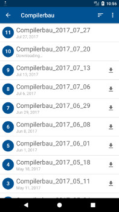
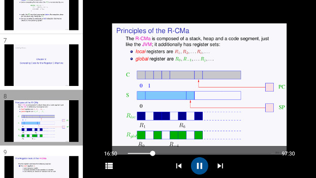

# TTT Android Client

This is an Android client to play recordings created with the [TeleTeachingTool](http://ttt.in.tum.de/), which is being developed at the Technical University of Munich.

It is an almost complete re-write of the [original Android client by Thomas Krex](https://versioncontrolseidl.in.tum.de/petter/tttandroidclient), following its basic structure, but with the following differences:
* Written in Kotlin (except for code adopted directly from the old app)
* Focus on more recent Android versions (minimum version is Android 5.0)
* Modern Material Design UI
* Usage of the Android Architecture Components: Room, LiveData and ViewModel
* Separating TTT logic from UI
* Downloads in the background using Android's DownloadManager

## About
Created by Florian Märkl: https://www.metallic.software  
Partially based on the [original Android client by Thomas Krex](https://versioncontrolseidl.in.tum.de/petter/tttandroidclient)

This program is free software: you can redistribute it and/or modify
it under the terms of the GNU General Public License as published by
the Free Software Foundation, either version 3 of the License, or
(at your option) any later version.

This program is distributed in the hope that it will be useful,
but WITHOUT ANY WARRANTY; without even the implied warranty of
MERCHANTABILITY or FITNESS FOR A PARTICULAR PURPOSE.  See the
GNU General Public License for more details.

You should have received a copy of the GNU General Public License
along with this program.  If not, see <http://www.gnu.org/licenses/>.

